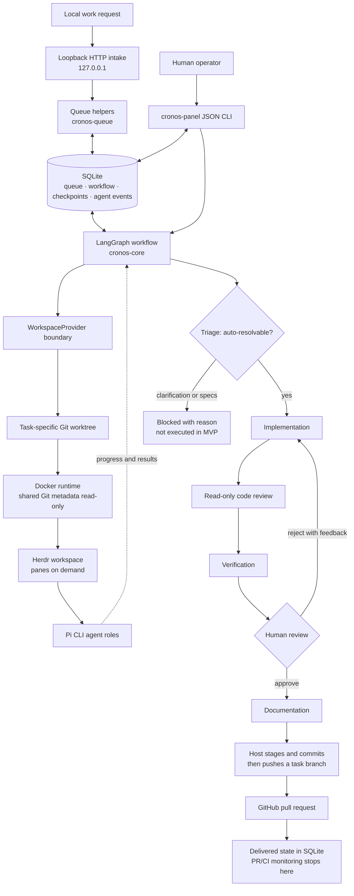

<p align="center">
  
</p>

<h1 align="center">Cronos AI</h1>

<p align="center">
  A human-supervised software factory that turns local engineering work into isolated, reviewed, and verifiable task runs—and, when approved, a GitHub pull request.
</p>

---

## What is Cronos AI?

Cronos AI is an agent-oriented software factory. It gives software work a controlled path from request to delivery instead of asking one general-purpose agent to make changes and hoping for the best.

A task is triaged, worked on in its own isolated workspace, reviewed and verified by separate agent roles, and presented to a human before documentation and delivery. The human can approve it or send it back with feedback. After approval, Cronos creates a task branch and GitHub pull request and records the result in SQLite.

The current MVP is intentionally narrow: local intake, one in-flight workflow, an operator CLI, explicit human approval, and GitHub PR creation. It is not a fully autonomous engineering organization, and it does not monitor a PR after creating it.

## Why a software factory now?

As AI coding tools make implementation faster and cheaper, the bottleneck shifts from producing code to operating it safely. More generated changes also mean more need for repeatable review, verification, traceability, and clear ownership.

Cronos treats agents as workers in a supervised process—not as unchecked maintainers of a repository. It provides:

- **Repeatable stages:** triage, implementation, code review, verification, human review, documentation, and delivery.
- **Containment:** each task runs in its own worktree and Docker runtime; agents do not own shared Git history or production delivery credentials.
- **Human accountability:** approval is explicit, and rejection feeds back into implementation and another review cycle.
- **Recoverability:** queue, workflow state, agent events, workspace identity, and LangGraph checkpoints are stored in SQLite. A restart interrupts active work; it never silently resumes it.
- **A controlled delivery boundary:** the host creates the commit and PR only after approval.

The goal is not to remove engineers from the loop. It is to let a team safely supervise more work while keeping decisions, failures, and responsibility visible.

## Architecture



The diagram summarizes the implemented MVP; the fuller workflow source is in [`design/cronos_ai_workflow.mmd`](design/cronos_ai_workflow.mmd).

### Main components

| Component | Responsibility |
| --- | --- |
| `cronos-core` | LangGraph workflow, loopback-only task intake, human review/rework, restart reconciliation, and orchestration contracts. |
| `cronos-queue` | Queue operations over the shared SQLite database. |
| `cronos-runtime` | Replaceable workspace/agent interfaces plus Herdr, Docker, and Pi CLI adapters. |
| `cronos-storage` | SQLite migrations, workflow/task state, event history, task inspection, and LangGraph checkpoints. |
| `cronos-panel` | JSON operator CLI for listing, inspecting, resuming, approving, and rejecting tasks. |

### Workflow at a glance

1. **Submit:** a local client sends a task description to `POST /tasks` on `127.0.0.1`; the request is validated and queued in SQLite.
2. **Triage:** Jev classifies the request. Only `auto_resolvable` proceeds; clarification and specification branches are recorded as blocked in this MVP.
3. **Build:** Pi coding roles work in a task-specific Git worktree mounted into an isolated Docker runtime. Herdr panes are opened only when a role needs them.
4. **Check:** code review and verification run with read-only tools. A failed quality gate stops the workflow.
5. **Review:** a human approves or rejects. Rejection returns the task to implementation and repeats review and verification.
6. **Deliver:** after approval, documentation runs; the host stages and commits the task changes, pushes a branch, creates a GitHub PR, and records the PR reference and `delivered` status.
7. **Recover:** after restart, active work is marked `interrupted`. An operator can explicitly resume it only when the matching SQLite checkpoint and workspace are available.

## Try it locally

### Requirements

- Bun, Git, Docker, and the Herdr CLI with its local service available.
- A Git repository and base branch for task work.
- A Docker runtime image containing `sh`, Git, Bun, Node.js 22.19 or newer, and Pi CLI. Cronos does not build or publish this image for you.
- A configured Pi chat model for coding roles. Triage calls Jev through Pi's codemode tool; Jev is a classifier, not the coding model.
- A GitHub App installation on one target repository for approved PR delivery. See [GitHub App setup](docs/github-app-setup.md).

### Install, test, and inspect

From the repository root:

```sh
bun install --frozen-lockfile
bun test

# See the local operator commands
bun run --filter cronos-panel start -- --help

# Open/migrate the default SQLite database and list tasks
bun run --filter cronos-panel start -- --db ./cronos.sqlite list
```

The regular test suite uses fakes and does not make model calls. The Herdr/Docker integration test is opt-in; instructions are in [`cronos-runtime/README.md`](cronos-runtime/README.md#development-and-tests).

### Configuration

Configure the following in the host process environment or a secret manager. Do not commit a populated `.env` file.

| Setting | Purpose |
| --- | --- |
| `CRONOS_DB_PATH` | SQLite database path; defaults to `./cronos.sqlite`. |
| `CRONOS_REPOSITORY_PATH` | Host-side Git repository used for task worktrees and delivery. |
| `CRONOS_RUNTIME_ROOT` | Host directory for task worktrees and temporary delivery clones. Prefer a directory outside the source repository. |
| `CRONOS_RUNTIME_IMAGE` | Image used for isolated agent execution. |
| `CRONOS_PI_CHAT_MODEL` | Pi chat model ID used by coding, review, verification, and documentation roles. |
| `CRONOS_RUNTIME_ENV` | Optional comma-separated **names** of host environment variables to allow into the task container, e.g. `OPENAI_API_KEY,TYPESAFE_API_KEY`. Pass names, never secret values. |
| `CRONOS_BASE_BRANCH` | Target base branch; defaults to `main`. |

Approved delivery additionally requires `CRONOS_GITHUB_OWNER`, `CRONOS_GITHUB_REPOSITORY`, `CRONOS_GITHUB_APP_ID`, `CRONOS_GITHUB_INSTALLATION_ID`, `CRONOS_GITHUB_REPOSITORY_ID`, and `CRONOS_GITHUB_APP_PRIVATE_KEY`. Keep the private key out of agent containers. Forward model-provider credentials only when required and narrowly scoped; GitHub delivery credentials are rejected from the runtime allowlist. Follow [`docs/github-app-setup.md`](docs/github-app-setup.md) for App permissions and configuration.

### Queue local work

`cronos-core` exports a loopback-only intake server. A host process can start it against the shared database like this:

```sh
bun -e '
import { createIntakeServer } from "./cronos-core/src/intake-server.ts";
import { openStorageDatabase } from "./cronos-storage/src/database.ts";

const db = await openStorageDatabase(Bun.env.CRONOS_DB_PATH ?? "./cronos.sqlite");
const port = Number(Bun.env.CRONOS_INTAKE_PORT ?? "3000");
const server = createIntakeServer(db, port);
console.log(`Cronos intake listening at ${server.url}`);
'
```

Then submit a task from the same machine:

```sh
curl --fail-with-body \
  -X POST http://127.0.0.1:3000/tasks \
  -H 'content-type: application/json' \
  -d '{"description":"Implement the first feature"}'
```

This starts the intake listener only; it queues work but does not run the orchestrator worker. The endpoint accepts a non-empty JSON `description`, limits request bodies to 64 KiB, and binds only to loopback. **Do not expose it through a public interface or reverse proxy.**

### Inspect and review tasks

The operator CLI prints JSON and uses the same SQLite database:

```sh
bun run --filter cronos-panel start -- --db ./cronos.sqlite list
bun run --filter cronos-panel start -- --db ./cronos.sqlite show <task-id>

# For a task at the human-review gate:
bun run --filter cronos-panel start -- --db ./cronos.sqlite approve <task-id>
bun run --filter cronos-panel start -- --db ./cronos.sqlite reject <task-id> \
  --feedback "Handle the empty input case"

# Restart recovery is always explicit:
bun run --filter cronos-panel start -- --db ./cronos.sqlite list --status interrupted
bun run --filter cronos-panel start -- --db ./cronos.sqlite resume <task-id>
```

Workflow actions require the repository/runtime/model settings above. `approve` and `resume` also require the GitHub App settings because either action may reach PR creation. `reject` requires review feedback and sends the task back through implementation, review, and verification.

> **Current integration boundary:** the repository provides the intake server, workflow functions, adapters, and operator CLI, but does not yet ship a single `cronos-ai start` command or a bundled always-on worker/service composition. An embedding host must run startup reconciliation before claiming work and invoke the core workflow. See [`cronos-core/README.md`](cronos-core/README.md) for the workflow and restart contracts, and the package READMEs for adapter configuration.

## Safety and MVP boundaries

- One task may be in flight at a time; multiple tasks can wait in the SQLite queue.
- Intake is loopback-only. Network-facing intake, authentication, and rate limiting are out of scope.
- Clarification/specification work is blocked rather than sent to an unsupported path.
- Agents edit task files, but commits, shared Git metadata, GitHub tokens, and PR creation are host-owned. The container can still have model/network egress; it is not an egress sandbox.
- Code review and verification roles are read-only. Human rejection feeds back into implementation.
- Resume is explicit and checkpoint/workspace-dependent; active tasks are never resumed automatically.
- The current panel is a CLI, not the future OpenTUI interface. Cronos stops tracking a task after PR creation; it does not monitor PR or CI events afterward.
- The automated delivery tests use a local bare Git remote and mocked GitHub API calls. A live disposable-repository GitHub App test still requires operator credentials and setup.

## Repository layout

```text
cronos-core/       LangGraph workflow, loopback intake, delivery integration
cronos-queue/      SQLite-backed queue operations
cronos-runtime/    Herdr/Docker workspace and Pi CLI adapters
cronos-storage/    SQLite schema, migrations, checkpoints, and inspection
cronos-panel/      Human operator CLI
assets/            Repository banner
design/             Workflow diagram sources and architecture image
docs/              GitHub App setup and operational guidance
openspec/          MVP proposal, design, specifications, and task progress
```

## Further reading

- [Cronos workflow diagram (Mermaid)](design/cronos_ai_workflow.mmd)
- [GitHub App setup](docs/github-app-setup.md)
- [Core workflow and intake](cronos-core/README.md)
- [Runtime and agent configuration](cronos-runtime/README.md)
- [Operator CLI](cronos-panel/README.md)
- [Storage](cronos-storage/README.md)
- [One-task MVP OpenSpec change](openspec/changes/one-task-mvp/)
