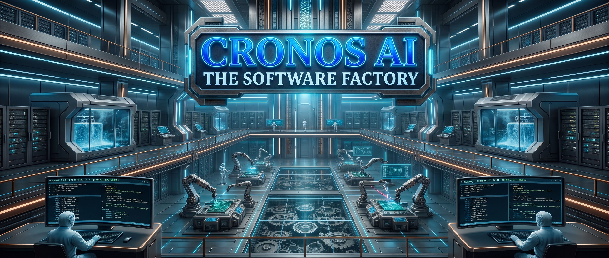

# Cronos AI - Engineering Software Manufacturing

<div align="center">
  
</div>

> [!WARNING]
> **Work in progress:** Cronos AI is actively evolving. Some integrations and automated workflows are available through Python APIs but are not yet orchestrated end to end by the CLI.

Cronos AI is a local-first software factory that orchestrates autonomous AI agents to plan, architect, build, and validate production-ready applications.

It is based on the Zach Lloyd ideas and proposals.

Read the [Cronos AI user guide](docs/factory-guide.html) for a first-use walkthrough and workflow diagram.

It requires Python 3.12 or newer, Git, `uv`, and the OpenSpec CLI on `PATH`.

## Contents

- [Technologies](#technologies)
  - [Application](#application)
  - [Agent and infrastructure integrations](#agent-and-infrastructure-integrations)
  - [Development toolchain](#development-toolchain)
- [Development setup](#development-setup)
- [Workflows](#workflows)
  - [Initialize a target repository](#initialize-a-target-repository)
  - [Request intake](#request-intake)
  - [Triage and planning](#triage-and-planning)
    - [Task states, retries, and review](#task-states-retries-and-review)
  - [Webhooks and delivery adapters](#webhooks-and-delivery-adapters)
  - [Sandbox prerequisites and recovery](#sandbox-prerequisites-and-recovery)
    - [Provider key and egress configuration](#provider-key-and-egress-configuration)
    - [Worktree recovery](#worktree-recovery)
  - [Pi, Herdr, and specialist profiles](#pi-herdr-and-specialist-profiles)
    - [Factory-managed profile resources](#factory-managed-profile-resources)
    - [Runtime verification](#runtime-verification)

## Technologies

### Application

- **Python 3.12+** provides the application runtime.
- **LangGraph** supports planning and orchestration workflows.
- **Pydantic** validates configuration and domain data.
- **SQLite** stores durable requests, task state, and human actions locally.
- **Git** provides repository validation, branches, and isolated worktrees.
- **OpenSpec CLI** creates and validates change artifacts for target repositories.

### Agent and infrastructure integrations

- **Pi** runs agents in RPC mode and requires Node.js 22.19 or newer.
- **Herdr** manages persistent sessions, workspaces, and worker panes.
- **Model Context Protocol (MCP)** exposes profile-approved tools through the bridge.
- **Docker** isolates worker execution and the network egress gateway.

### Development toolchain

- **uv** manages Python dependencies, environments, and builds.
- **pytest**, **Ruff**, and **mypy** provide tests, linting, and static type checking.

## Development setup

Install the exact locked package and development tools with:

```sh
uv sync --locked --extra dev
```

Run the test suite, lint, strict type check, and dependency security audit with:

```sh
uv run pytest
uv run ruff check .
uv run mypy
uv audit --locked
```

Build both wheel and source distributions with:

```sh
uv build --no-sources --out-dir dist
```

Verify a clean virtual environment can install the built wheel and run the CLI with:

```sh
BUILD_DIR="$(mktemp -d)"
trap 'rm -rf "$BUILD_DIR"' EXIT
uv build --no-sources --out-dir "$BUILD_DIR/dist"
uv venv "$BUILD_DIR/venv"
uv pip install --python "$BUILD_DIR/venv/bin/python" "$BUILD_DIR"/dist/*.whl
"$BUILD_DIR/venv/bin/cronos-ai" --version
```

## Workflows

### Initialize a target repository

The target must already exist and be the root of a Git working tree.

Run initialization with an explicit repository path:

```sh
uv run cronos-ai init --repo /path/to/repository
```

The command validates the Git root before calling `openspec init --tools none` for that exact repository.

It does not initialize the current working directory implicitly or modify a different repository.

An existing OpenSpec root with `openspec/config.yaml` or `openspec/config.yml` is left unchanged.

Initialization rejects a non-Git directory, a nested directory inside a repository, and an existing but unconfigured `openspec/` directory.

Check the installed command syntax with:

```sh
uv run cronos-ai init --help
```

### Request intake

Request intake is available through both the CLI and Python API.

It requires an explicit path to a Git repository root with an initialized OpenSpec configuration and a clean working tree.

The CLI validates the target and durably queues the request in the local controller database:

```sh
uv run cronos-ai run --repo /path/to/repository --request "Improve the settings page"
```

Tracked changes, staged changes, and untracked files cause intake to fail without modifying the target.

```python
from pathlib import Path

from cronos_ai.intake import intake_request

request = intake_request(
    Path("/path/to/repository"),
    "Improve the settings page",
)
```

The resulting request has a generated identifier, the resolved repository path, and the user-provided description.

### Triage and planning

Triage outcomes must be recorded explicitly; the factory does not guess intent from request text.

An actionable request can proceed to concise planning and may dispatch directly when it has no high-impact risk.

A specifications-required request can proceed to detailed OpenSpec planning, but implementation remains gated on human approval.

A clarification-required request must include at least one blocking question and cannot proceed to planning or dispatch.

A parked request cannot proceed until a human resumes it through a later workflow action.

```python
from cronos_ai.models import TriageOutcome
from cronos_ai.triage import triage_request

triage = triage_request(
    request,
    TriageOutcome.ACTIONABLE,
    rationale="The requested change is clear and bounded.",
)
```

Create a run branch, generate and validate its OpenSpec change, and commit the plan without changing the original checkout with:

```python
from cronos_ai.run_branch import create_run_branch_with_plan

run = create_run_branch_with_plan(
    request,
    triage,
    Path("/path/to/factory-worktrees/request-<request-id>"),
)
print(run.plan.change_dir)
```

The worktree path must be outside the target repository, which must still have a clean working tree and initialized OpenSpec root.

The factory creates a run branch from the starting commit and commits the generated plan there.

It invokes `openspec new change` and `openspec validate` inside the isolated run worktree.

Specifications-required work and high-impact requests receive a detailed planning draft that calls for human approval before implementation.

High-impact categories include substantial work, security, authentication, destructive migrations, production infrastructure, and deployment changes.

Approval decisions are bound to the change name and a fingerprint of its plan files, so edits invalidate earlier approval.

The local controller owns a process lock and records its lifecycle in SQLite.

Start it in the foreground with:

```sh
uv run cronos-ai controller start
```

Inspect its status and the queued work with:

```sh
uv run cronos-ai status
```

Human actions are stored durably for controller processing.

List tasks and requests that need human decisions with:

```sh
uv run cronos-ai attention
```

The attention queue omits tasks waiting only for dependencies and includes each item's reason, latest result, and next action.

Use `cronos-ai attention --json` for structured output.

Submit a clarification answer with:

```sh
uv run cronos-ai action --action clarify-request --target request-id --data "answer=Use the current account default"
```

Run-scoped actions include `--run <run-id>` and target a task ID or the run-level review.

For example, retry an eligible failed task with:

```sh
uv run cronos-ai action --action retry-task --run <run-id> --target <task-id>
```

Plan approval must include the exact plan fingerprint shown in the attention item and a reviewer.

Conflict resolution requires resolving and staging the conflict in the run worktree before submitting the action with a resolution note.

Actions retain their actor, run/task scope, payload, timestamp, and processing outcome in SQLite.

Inspect the audit log with `uv run cronos-ai actions` or use `uv run cronos-ai actions --json` for structured output.

Supply code-review findings, automated check results, and user-perspective evidence as JSON with `uv run cronos-ai review --run <run-id> --evidence review-evidence.json`.

A packet with failed checks or blocking findings is recorded as blocked and returns integrated work to remediation.

Inspect an integrated review packet, including its diff, findings, automated checks, user scenarios, and decision, with `uv run cronos-ai review --run <run-id>`.

Review approval is tied to the exact integrated diff and evidence fingerprint.

Approve the packet using the fingerprint printed by `cronos-ai attention`:

```sh
uv run cronos-ai action --action approve-review --run <run-id> --target run --data review_hash=<fingerprint> --data reviewer=<name>
```

Reject it with a rationale to return integrated tasks to remediation:

```sh
uv run cronos-ai action --action reject-review --run <run-id> --target run --data review_hash=<fingerprint> --data reviewer=<name> --data rationale="Describe requested changes"
```

#### Task states, retries, and review

| State               | Meaning                                                                  | Human attention                                           |
| ------------------- | ------------------------------------------------------------------------ | --------------------------------------------------------- |
| `queued`            | Waiting for dependencies or scheduling.                                  | Dependency-only waits are not human blockers.             |
| `ready`             | Eligible for a worker or remediation assignment.                         | Not a blocker by itself.                                  |
| `running`           | Assigned to an active worker.                                            | Herdr reports `Working`.                                  |
| `integrating`       | Worker finished successfully and its branch awaits integration.          | Not a human blocker.                                      |
| `waiting for human` | Requires clarification or an approval decision.                          | Appears with the reason and next action.                  |
| `blocked`           | Cannot proceed, for example because of a merge conflict.                 | Appears with the reason and recovery action.              |
| `failed`            | Execution stopped after a failure.                                       | Retry is offered only below the configured attempt limit. |
| `review`            | Integrated and available to downstream tasks, awaiting run-level review. | Appears after a review packet is ready.                   |
| `done`              | Human-approved review completed for the task.                            | Herdr shows the `Done` label.                             |

`FactoryConfig.max_attempts` defaults to three attempts and bounds transient retries and remediation assignments.

A retry action never increases or resets that limit.

Exhausted retries show a policy-escalation step instead of offering an out-of-policy retry.

Failed or inconclusive CI/CD workflows appear in the attention queue and are never considered delivered.

Review packets require at least one automated check and one user-perspective scenario result.

Failed checks, failed scenarios, or blocking review findings create a blocked packet and return eligible tasks to remediation.

A human decision applies only to the latest packet and only while its integrated diff and evidence fingerprints remain unchanged.

The delivery gate remains closed after rejection, missing evidence, a changed diff, or an inconclusive review.

The default state directory is `$XDG_STATE_HOME/cronos-ai` when `XDG_STATE_HOME` is set, or `~/.local/state/cronos-ai` otherwise.

On first use of the default location, Cronos AI moves an existing `ai-software-factory` state directory to the corresponding `cronos-ai` location.

The migration preserves the directory contents, including `factory.sqlite3`, its schema, queued requests, and human actions.

If both default directories exist, Cronos AI stops with an actionable error and leaves both unchanged.

Back up both directories, choose the authoritative state, then move the other directory out of the state root before restarting.

Use `--state-dir` or `CRONOS_AI_STATE_DIR` to select a custom location; either explicit override bypasses default-path migration.

`AI_SOFTWARE_FACTORY_STATE_DIR` is not recognized.

If you previously used that variable, set `CRONOS_AI_STATE_DIR` to the same custom state path.

Request submission and human actions are durable even if the controller is stopped.

The controller can be stopped with Ctrl+C, and its process lock is released on exit.

To restart it, run the same command with the same state directory.

Queued requests and human actions remain in `factory.sqlite3` and are visible after restart without being re-enqueued by controller startup.

Use `cronos-ai status` with the same `--state-dir` to inspect the recovered queue.

### Webhooks and delivery adapters

`WebhookEndpoint` is a WSGI application that can be mounted at `POST /webhooks/<source-id>`.

The factory does not start a network listener, install a reverse proxy, or provide a hosted relay.

Expose it only through operator-managed private reachability and TLS.

Configure each `WebhookSource` with a distinct high-entropy secret of at least 32 bytes and an explicit absolute-path repository allowlist.

The endpoint accepts JSON objects containing only `repository` and `description`.

Alert descriptions and repository paths are untrusted input and are checked by ordinary clean-repository OpenSpec intake before a request is queued.

Webhook events never include commands and cannot set triage outcomes, task states, approvals, or CI/CD results.

Sign the exact raw request body using HMAC-SHA256 over `timestamp.source-id.event-id.body`.

Send the timestamp as Unix seconds in `X-Factory-Timestamp`, the source event identifier in `X-Factory-Event-Id`, and the lowercase digest as `sha256=<hex>` in `X-Factory-Signature`.

The default timestamp window is 300 seconds and the default body limit is 65,536 bytes.

The `(source-id, event-id)` key is deduplicated durably, and reuse with different content is rejected.

`WebhookIngestor` turns authenticated events into monitoring requests only after ordinary clean-repository OpenSpec intake succeeds.

Those requests remain untriaged until the normal planning flow processes them, and high-impact work still requires approval.

The integration does not supply a production CI/CD provider or credentials.

Inject a `CIAdapter` into `DeliveryCoordinator` only after a human approves the current review packet.

Adapters implement `dispatch(request)` and `status(external_id)` using the `CICDRequest` and `CICDResult` models.

Requests include the approved branch revision, review fingerprint, repository, and deterministic idempotency key.

Provider credentials belong in the adapter's secure configuration and must not be copied into webhook payloads, run context, or SQLite records.

Only a conclusive `succeeded` status for the approved, unchanged review can report delivery success.

Missing adapter configuration, failed workflows, or inconclusive statuses remain undelivered.

`FakeCIAdapter` is deterministic and intended for tests, not production delivery.

### Sandbox prerequisites and recovery

The Docker sandbox requires a running Docker-compatible daemon and an engine that supports Linux containers, shared network namespaces, bind mounts, resource limits, and the `NET_ADMIN`, `SETUID`, and `SETGID` capabilities for the egress gateway only.

Check daemon availability before starting a sandbox with:

```sh
docker info
```

The adapter fails closed if Docker is unavailable, the gateway image cannot be built, its firewall or proxy does not become ready, or the worker container cannot start.

The worker container runs without Linux capabilities, with a read-only root filesystem, an unprivileged user, a PID limit, memory and CPU limits, and no-new-privileges enabled.

Its only host bind mount is the task worktree at `/workspace`; temporary writes go to an ephemeral container tmpfs.

The egress gateway uses a separate network namespace container and does not mount the task worktree or receive provider credentials.

#### Provider key and egress configuration

A specialist profile names the environment variable containing its dedicated provider API key with `provider_api_key_env`.

Set that variable in the factory process environment before launching the worker, and do not put the key value in command arguments, profiles, SQLite state, or documentation.

Only the named key is explicitly passed to the worker; the worker code can read it, so use a narrowly scoped key and rotate it if exposed.

The host Pi configuration and authentication directory are never mounted into the worker.

Configure outbound destinations as HTTPS origins in `SpecialistProfile.network_allowlist`.

The adapter permits CONNECT traffic only to allowlisted hostnames on port 443, requires TLS SNI to match the selected hostname, resolves destinations before connecting, and rejects private or non-public IP addresses.

Direct worker network access, non-HTTPS protocols, unlisted hosts, and alternate ports are blocked.

For example, a profile may allow `https://api.provider.example` and an explicitly approved package registry origin.

Paths, credentials, query strings, and non-HTTPS origins are rejected from the egress allowlist.

An empty allowlist denies all proxied destinations.

The sandbox adapter is currently exposed as a Python API and is not yet automatically dispatched by the controller.

```python
from cronos_ai.models import SpecialistProfile
from cronos_ai.sandbox import DockerSandboxAdapter

profile = SpecialistProfile(
    name="implementer",
    role="Implementation",
    model="configured-model",
    provider="configured-provider",
    provider_api_key_env="FACTORY_PROVIDER_KEY",
    network_allowlist=("https://api.provider.example",),
)

sandbox = DockerSandboxAdapter(worker_image="configured-worker-image")
result = sandbox.run(task_worktree.path, profile, ("configured-worker-command",))
```

Run the opt-in Docker isolation test with a live daemon using:

```sh
CRONOS_AI_DOCKER_E2E=1 uv run pytest tests/test_sandbox_docker.py
```

The test verifies task-worktree access, unavailable host authentication paths, provider-key injection, direct-egress denial, and blocked unlisted proxy destinations.

#### Worktree recovery

Inspect registered Git worktrees and the state of a task checkout with:

```sh
git -C /path/to/repository worktree list
git -C /path/to/task-worktree status --short
```

Task worktrees are outside the original checkout and have separate task branches based on the run branch.

`TaskWorktreeManager.cleanup` removes only a clean managed worktree and preserves its task branch for later inspection or integration.

If a task worktree has uncommitted changes, cleanup fails without discarding them.

When an integration conflict occurs, the run worktree retains its conflict state and both task and run branches remain available for human resolution.

Do not use force removal to recover a dirty task worktree; inspect or preserve its changes first.

### Pi, Herdr, and specialist profiles

The tested local versions are Pi 0.87.1, Herdr 0.9.1, Docker Engine 29.8.1, and Node.js 26.10.0.

Pi requires Node.js 22.19 or newer.

Verify the installed versions and Docker daemon with:

```sh
pi --version
herdr --version
node --version
docker info
```

The controller starts a named headless Herdr server with `herdr --session <name> server` when the configured session socket is not reachable.

Inspect available sessions with `herdr session list` and attach to a named session with `herdr session attach <name>` when you want to view its panes.

Herdr pane and workspace operations use its local newline-delimited JSON Socket API.

The `cronos-ai` CLI starts the controller and displays queued work, while Herdr presents the reusable worker panes and their status.

Fine-grained queued and ready tasks map to Herdr's idle worker state.

Running and integrating work map to working, while human waits, blocked tasks, failures, and review map to blocked.

Completed tasks map to Herdr's idle agent state with the `Done` sidebar label.

Task summaries are prefixed with the task ID and bounded to 240 characters.

#### Factory-managed profile resources

Store factory profiles in an explicit resource directory outside the target repository.

The directory contains a `profiles.json` manifest and a `skills/` tree containing one `SKILL.md` directory for each approved skill.

Each profile selects a provider, model, API-key environment-variable name, skills, MCP tools, and HTTPS egress origins.

For example, `profiles.json` can contain:

```json
{
  "profiles": {
    "implementer": {
      "name": "implementer",
      "role": "Implementation",
      "model": "configured-model",
      "provider": "configured-provider",
      "provider_api_key_env": "FACTORY_PROVIDER_KEY",
      "skills": ["python"],
      "mcp_tools": ["repo/status"],
      "network_allowlist": ["https://api.provider.example"]
    }
  },
  "mcp_servers": [
    {
      "server_id": "repo",
      "command": "factory-mcp-repo",
      "arguments": ["--stdio"],
      "tools": ["status", "diff"]
    }
  ]
}
```

Install or provide `factory-mcp-repo` inside the configured worker image.

MCP server command definitions are factory-managed and are not discovered from the host or target project.

Use `server/tool` identifiers to select individual MCP tools in a profile.

The factory bridge starts only the declared MCP servers, checks their tool catalogs, and registers only the profile-selected tools in Pi.

MCP server child processes receive a restricted environment without the provider API key.

Pi is started in RPC mode with host and project extensions, skills, prompt templates, themes, and context files disabled by default.

The supervisor adds only factory-resolved skill paths and the generated MCP bridge extension.

The worker runs inside the Docker sandbox, and its network access remains subject to the profile's HTTPS origin allowlist.

Resolve a profile against both the factory resource root and the target repository:

```python
from pathlib import Path

from cronos_ai.profiles import FactoryProfileRegistry

registry = FactoryProfileRegistry(Path("/path/to/factory-resources"))
profile = registry.resolve(
    "implementer",
    target_repository=Path("/path/to/repository"),
)
```

The factory resource root must be separate from the target repository.

The registry rejects missing skills, symlink escapes, unknown MCP servers, and tool names absent from the factory catalog.

The profile's `provider_api_key_env` field contains an environment-variable name, never the key value.

Set the configured variable in the controller environment before dispatch, and do not store its value in profile files, MCP command arguments, task plans, or logs.

#### Runtime verification

The opt-in Docker end-to-end tests use a fake Pi RPC child and fake Herdr Socket API with a real Docker sandbox.

They verify the task-worktree mount, provider-key availability, blocked direct and unlisted network access, and unavailable host authentication paths:

```sh
CRONOS_AI_DOCKER_E2E=1 uv run pytest tests/test_worker_e2e.py tests/test_sandbox_docker.py
```

The opt-in Pi end-to-end test uses a fake MCP server and does not make a model API call:

```sh
CRONOS_AI_PI_E2E=1 uv run pytest tests/test_pi_mcp_bridge_e2e.py
```

The Herdr lifecycle tests use fake CLI and Socket API responses so they do not create, focus, or close a real user session.
