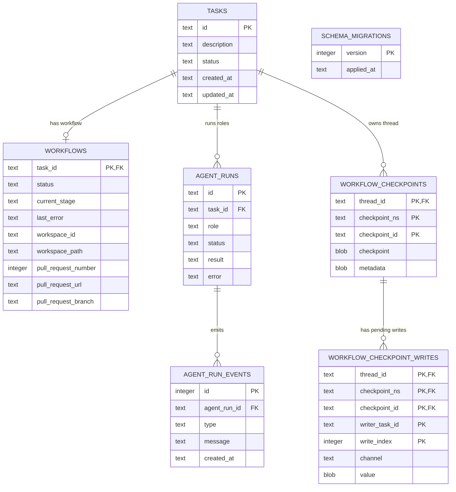

# Cronos SQLite Database

This document describes the durable SQLite schema used by Cronos, what each table owns, and the design trade-offs behind the current MVP. The source of truth for exact DDL remains the ordered migrations in [`cronos-storage/migrations/`](../cronos-storage/migrations/).

## Database role and boundaries

Cronos opens one shared SQLite database through `openStorageDatabase()` in `cronos-storage`. Queue helpers, workflow persistence, task inspection, and the LangGraph checkpointer use that same `bun:sqlite` connection. SQLite is the only durable store for queue and workflow state; there is no separate JSON state file or database per component.

The database stores task descriptions and status, workflow progress, agent run summaries/events, checkpoint payloads, persisted workspace identity/path, and the GitHub pull-request reference. It does **not** store the task worktree's source files or the Docker/Herdr resources themselves. Those remain in the host/runtime filesystem and are addressed by the workspace handle kept in `workflows`.



`schema_migrations` is the migration ledger rather than a task entity. The `TASKS` to `WORKFLOWS` relationship is one-to-zero-or-one because `workflows.task_id` is its primary key. Foreign keys are enabled when the storage database is opened.

## Tables

### `tasks` — request and top-level lifecycle

One row represents one piece of submitted work.

| Column        | Type   | Rules / purpose                                                   |
| ------------- | ------ | ----------------------------------------------------------------- |
| `id`          | `TEXT` | Primary key; generated by the intake layer.                       |
| `description` | `TEXT` | Required and non-blank (`CHECK length(trim(description)) > 0`).   |
| `status`      | `TEXT` | Required; constrained to the task statuses below.                 |
| `created_at`  | `TEXT` | Required creation timestamp.                                      |
| `updated_at`  | `TEXT` | Required last-update timestamp, maintained by storage operations. |

Allowed task statuses are `queued`, `active`, `review_pending`, `interrupted`, `blocked`, `errored`, and `delivered`. The index `tasks_status_created_idx` supports status-filtered and oldest-first queue queries.

A partial unique index, `tasks_single_inflight_workflow_idx`, permits at most one task whose status is `active`, `review_pending`, or `interrupted`. This is the cross-connection/database guard for the MVP's one-in-flight-workflow rule; it is not merely an in-process mutex. `queued`, `blocked`, `errored`, and `delivered` tasks do not hold that lock.

### `workflows` — stage, recovery handle, and delivery result

A workflow row is created when a queued task is claimed. Its `task_id` is both the primary key and a foreign key to `tasks(id) ON DELETE CASCADE`.

| Column                     | Type      | Rules / purpose                                                                                                                                                                                      |
| -------------------------- | --------- | ---------------------------------------------------------------------------------------------------------------------------------------------------------------------------------------------------- |
| `task_id`                  | `TEXT`    | Primary/foreign key; one workflow record per task.                                                                                                                                                   |
| `status`                   | `TEXT`    | Required; one of `pending`, `running`, `blocked`, `errored`, `interrupted`, or `completed`.                                                                                                          |
| `current_stage`            | `TEXT`    | Required workflow stage, such as `triage`, `implementation`, `final_review`, `documentation`, `pull_request`, or a terminal stage. It is intentionally not a SQL enum/check so the graph can evolve. |
| `last_error`               | `TEXT`    | Nullable operator-facing reason for a blocked, failed, or interrupted workflow.                                                                                                                      |
| `created_at`, `updated_at` | `TEXT`    | Required lifecycle timestamps.                                                                                                                                                                       |
| `workspace_id`             | `TEXT`    | Nullable provider-owned identity used to validate/restore the existing runtime workspace.                                                                                                            |
| `workspace_path`           | `TEXT`    | Nullable host path to the task worktree. Stored with the handle for restart reconciliation.                                                                                                          |
| `pull_request_number`      | `INTEGER` | Nullable GitHub PR number; filled after confirmed delivery.                                                                                                                                          |
| `pull_request_url`         | `TEXT`    | Nullable PR URL; checked against the PR number before persistence.                                                                                                                                   |
| `pull_request_branch`      | `TEXT`    | Nullable task branch name.                                                                                                                                                                           |

Task status and workflow status/stage are deliberately separate. For example, a task can be `review_pending` while its graph workflow remains `running` at `final_review`: the workflow is paused for an operator decision, not complete. When delivery succeeds, the task becomes `delivered`, the workflow becomes `completed` at stage `delivered`, the PR reference is saved, and workspace identity/path are cleared.

Workspace columns identify external filesystem/runtime resources; they do not make those resources part of SQLite. Explicit resume requires both this persisted workspace identity/path and the corresponding LangGraph checkpoint. If either is missing or mismatched, the task remains interrupted rather than silently receiving a new worktree.

### `agent_runs` — role-level execution records

Each agent invocation gets a separate row linked to its task with `task_id REFERENCES tasks(id) ON DELETE CASCADE`.

| Column                      | Type   | Rules / purpose                                                                                                                   |
| --------------------------- | ------ | --------------------------------------------------------------------------------------------------------------------------------- |
| `id`                        | `TEXT` | Primary key for one role invocation.                                                                                              |
| `task_id`                   | `TEXT` | Required task foreign key.                                                                                                        |
| `role`                      | `TEXT` | Role name (for example triage, implementation, code review, verification, or documentation).                                      |
| `status`                    | `TEXT` | Required; constrained to `pending`, `running`, `succeeded`, `failed`, or `interrupted`.                                           |
| `result`                    | `TEXT` | Nullable JSON-serialized agent summary/structured result. Serialized results are capped at 256,000 characters by the storage API. |
| `error`                     | `TEXT` | Nullable failure detail, capped by the storage API.                                                                               |
| `started_at`, `finished_at` | `TEXT` | Nullable execution timestamps.                                                                                                    |
| `created_at`                | `TEXT` | Required record-creation timestamp.                                                                                               |

`agent_runs_task_created_idx` supports task inspection in creation order. A new row is written for each role run; rework therefore adds new runs instead of overwriting the prior attempt's summary.

### `agent_run_events` — inspectable progress history

Events are appended as an agent run starts, reports progress, completes, or fails. Each event references `agent_runs(id) ON DELETE CASCADE`.

| Column         | Type      | Rules / purpose                                                           |
| -------------- | --------- | ------------------------------------------------------------------------- |
| `id`           | `INTEGER` | `AUTOINCREMENT` primary key, also a stable ordering tie-breaker.          |
| `agent_run_id` | `TEXT`    | Required foreign key to the role run.                                     |
| `type`         | `TEXT`    | Required; constrained to `started`, `progress`, `completed`, or `failed`. |
| `message`      | `TEXT`    | Required event detail, capped at 4,000 characters by the storage API.     |
| `created_at`   | `TEXT`    | Required event timestamp.                                                 |

`agent_run_events_run_created_idx` indexes `(agent_run_id, created_at, id)` for ordered event history. The event type describes an emitted event; the final run state (including `interrupted`) is in `agent_runs.status`.

### `workflow_checkpoints` — serialized LangGraph snapshots

The LangGraph thread ID is the corresponding task ID. Checkpoint payloads and metadata are stored as SQLite `BLOB`s using LangGraph's typed serializer; this is binary checkpoint storage inside the database, not an external JSON state file.

| Column                 | Type   | Rules / purpose                                                                     |
| ---------------------- | ------ | ----------------------------------------------------------------------------------- |
| `thread_id`            | `TEXT` | Required foreign key to `tasks(id) ON DELETE CASCADE`.                              |
| `checkpoint_ns`        | `TEXT` | Required namespace, default `''`.                                                   |
| `checkpoint_id`        | `TEXT` | Required ID for this checkpoint.                                                    |
| `parent_checkpoint_id` | `TEXT` | Nullable predecessor ID; retained as checkpoint metadata rather than a foreign key. |
| `checkpoint_type`      | `TEXT` | Serializer type tag for the checkpoint blob.                                        |
| `checkpoint`           | `BLOB` | Required serialized graph state.                                                    |
| `metadata_type`        | `TEXT` | Serializer type tag for metadata.                                                   |
| `metadata`             | `BLOB` | Required serialized graph metadata.                                                 |
| `created_at`           | `TEXT` | Required checkpoint timestamp.                                                      |

The composite primary key is `(thread_id, checkpoint_ns, checkpoint_id)`. The checkpointer can load a requested checkpoint or the latest checkpoint for a thread/namespace and uses checkpoint history to resume the saved graph.

### `workflow_checkpoint_writes` — pending graph writes

LangGraph may persist pending writes associated with a checkpoint. Rows are keyed by `(thread_id, checkpoint_ns, checkpoint_id, writer_task_id, write_index)` and have a composite foreign key to the parent checkpoint with `ON DELETE CASCADE`.

`channel`, `value_type`, and `value` preserve the write's graph channel and typed serialization. `writer_task_id` identifies the LangGraph writer task; it is distinct from Cronos's `agent_runs.id`. Keeping pending writes separate lets the checkpointer reconstruct the exact checkpoint tuple needed by the graph runtime.

### `schema_migrations` — applied schema versions

Created by `migrateStorageDatabase()` before migrations run. It contains `version INTEGER PRIMARY KEY` and `applied_at TEXT NOT NULL`. Each migration's DDL and ledger insert run transactionally; already-recorded versions are skipped, making repeated opens idempotent.

## Migration history

Migrations are applied in numeric order. Existing migration files are immutable history; schema changes should be added as a new migration rather than rewriting a migration that may already have been applied.

| Version | Change                                                                                                                    |
| ------- | ------------------------------------------------------------------------------------------------------------------------- |
| `001`   | Creates tasks, workflows, agent runs, and LangGraph checkpoint/checkpoint-write tables; adds queue and task-run indexes.  |
| `002`   | Adds an initial partial unique index allowing only one `active` task.                                                     |
| `003`   | Replaces that index with a database-wide one-in-flight constraint covering `active`, `review_pending`, and `interrupted`. |
| `004`   | Adds agent run event history and its lookup index.                                                                        |
| `005`   | Adds nullable workspace identity and path to workflows for restart reconciliation.                                        |
| `006`   | Adds nullable GitHub PR number, URL, and branch to workflows.                                                             |

`schema_migrations` itself is bootstrap DDL managed by the migration runner; the versioned SQL starts with `001_initial.sql`.

## Lifecycle and consistency

Typical state transitions write related task/workflow records in a transaction:

```text
queued
  └─ claim → active + running workflow at triage
       ├─ unsupported route → blocked + blocked workflow
       ├─ gate/action failure → errored + errored workflow
       ├─ human gate → review_pending + running workflow at final_review
       │    ├─ reject → active + running workflow, implementation resumes
       │    └─ approve → documentation → pull_request → delivered + completed workflow
       └─ process restart → interrupted + interrupted workflow
            └─ explicit resume → active + running workflow, if checkpoint/workspace match
```

The application uses prepared, parameterized SQL and transactions around task claims, review transitions, interruption/resume, and delivery. The database enforces the most important global invariants independently of those code paths:

- status values and non-blank task descriptions are checked by SQL;
- foreign keys keep child records tied to their task/run/checkpoint;
- the partial unique index prevents two in-flight tasks, even across separate SQLite connections;
- delivery metadata is written together with the task's `delivered` transition.

Timestamps are stored as ISO-8601 UTC strings produced by JavaScript `toISOString()`. Stage names, agent role names, event messages, and most workflow relations are validated by application logic rather than SQL enums.

## Design considerations and trade-offs

- **SQLite fits the current operating model.** Cronos is local-first and deliberately runs one in-flight task. One file provides a simple durable source of truth and transactional guardrails without a separate service to deploy. A multi-host worker pool or materially higher write concurrency would be a reason to revisit the database adapter, not to remove the one-in-flight invariant casually.
- **Queryable lifecycle fields stay relational.** Task status, workflow status/stage, errors, workspace handles, and PR references are ordinary columns so the CLI can filter and inspect them without decoding a large serialized application object.
- **LangGraph owns graph-state serialization.** Checkpoint and pending-write payloads remain typed blobs with serializer tags; Cronos does not duplicate the graph state in a second JSON format.
- **Role attempts and events are history.** Rework creates more `agent_runs`; progress is stored separately so the latest result can be inspected without losing earlier attempts. There is no retention/pruning policy in this MVP.
- **External resources need their own lifecycle.** The database stores a workspace identity/path and checkpoint, not worktree bytes or live Docker/Herdr sessions. The host must preserve those resources for recovery and validate them before resuming.
- **The database may contain sensitive project context.** Task descriptions, error text, agent output, event messages, workspace paths, and checkpoint blobs can reveal repository details. Protect the database file and backups with appropriate filesystem permissions and retention. GitHub App private keys and installation tokens are not stored here.
- **Growth needs monitoring.** Agent results and event messages are bounded at write time, but checkpoint history and event rows are not automatically pruned. Backup, restore, retention, and checkpoint compaction should be designed before long-running production use.

## Useful implementation references

- [Migration runner](../cronos-storage/src/database.ts)
- [Workflow/task persistence](../cronos-storage/src/workflow-store.ts)
- [LangGraph SQLite checkpointer](../cronos-storage/src/bun-sqlite-checkpointer.ts)
- [Task and agent inspection queries](../cronos-storage/src/task-inspection.ts)
- [Storage package guide](../cronos-storage/README.md)
