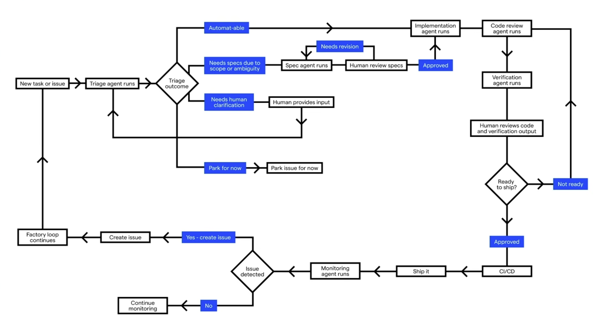
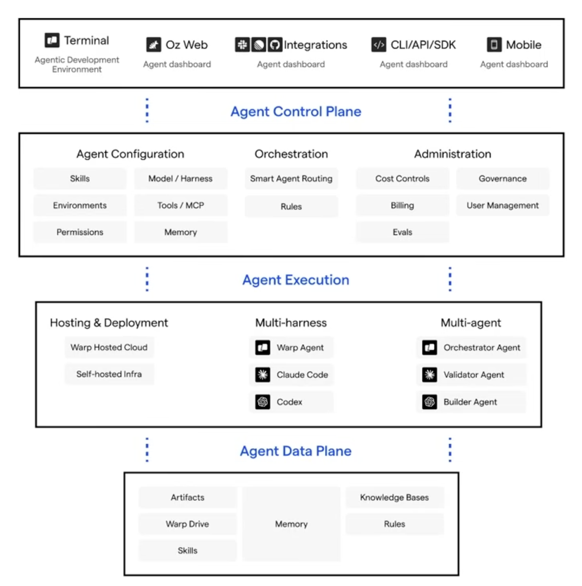

# Cronos AI: Self-improving Software Factory

- Factory Mindset
  - You won't be building the product
  - You will be building the thing that builds the product

## Inputs

- Task trackers
- Clients feedback
- Slack
- Terminal/IDE

## Triage

- Issue is easy -> Implement
- Issue is hard -> Product specs and Tech specs

## Specs

- Product specs: Product behaviors and invariants
- Tech specs: Architecture and code shape

## Implementation

- Coding agent runs and makes a diff

## Review

- Agentic code review
- [Optional] Human code review

## Verification

- Verify changes from the user perspective

## CI/CD

- Still use CI/CD for deployment and testing

## Monitoring

- Create agents to respond to production events
  - Ex: server error -> automated agent triages and fixes the issue

## Factory Primitives

## Factory Efficiency

- You need to mesure and improve

Factory efficency = Software shipped / (tokens cost + human cost)

- You need loops for improving the system
  - Inner loop: new issues and triage
  - Outer loop: skill updated, reviews comments, agent PRs
